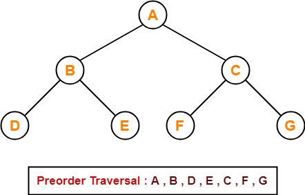
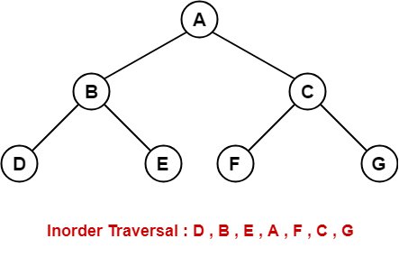
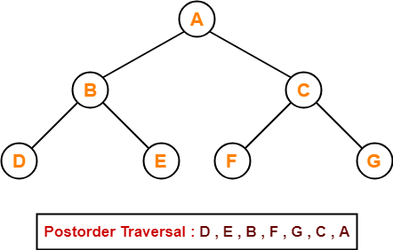
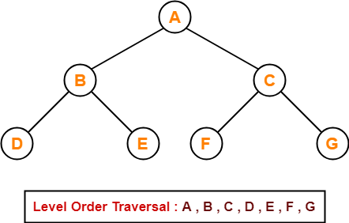
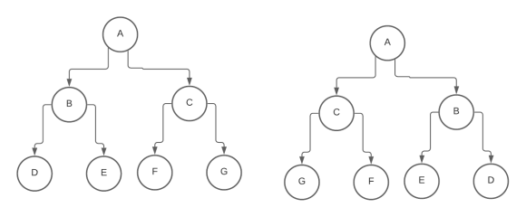

# Data Structures

- [**Notes**](#data-structures---notes)
- [**Resources**](#data-structures---resources)

## Data Structures - Notes

### Binary Search Tree

***Binary Search Tree*** is a node-based binary tree data structure.

Properties:

- The left subtree of a node contains only nodes with values lesser than the node’s value
- The right subtree of a node contains only nodes with values greater than the node’s value
- The left and right subtrees must each be a ***Binary Search Tree***
- There must be no duplicate nodes
- A ***Binary Search Tree*** with height *H* may have *N* nodes where

      H ≤ N ≤ 2ᴴ - 1
- **Inorder** traversal of ***Binary Search Tree*** always produces sorted output
- We can construct a ***Binary Search Tree*** with only **Preorder** or **Postorder** or **Level Order** traversal
- We can always get **Inorder** traversal by sorting another given traversal
- The longest path's length of a ***Binary Search Tree*** is equal to the Tree's height

Nodes:

- The top node of a ***Binary Search Tree*** is called '*Root*'
- A node with at least 1 '*Child*' node is called '*Parent*'
- When it has no '*Children*' nodes, a node is called '*Leaf*'
- '*Children*' nodes with the same '*Parent*' can be called '*Siblings*'

A ***Binary Search Tree*** can be displayed by a graph (as shown below) or by traversing it.

Traversing the ***Binary Search Tree***

Possible traversals are **Preorder**, **Inorder**, **Postorder** and **Level Order**.

- **Preorder**

  How it works:

  1. Visit the root
  2. Traverse the left subtree
  3. Traverse the right subtree

  
- **Inorder**

  The **Inorder** traversal of a ***Binary Search Tree*** always returns the nodes in a sorted order.

  How it works:

  1. Traverse the left subtree
  2. Visit the root
  3. Traverse the right subtree

  
- **Postorder**

  How it works:

  1. Traverse the left subtree
  2. Traverse the right subtree
  3. Visit the root

  

Notice how, in the previous 3 traversals, the root changes priority.

It starts as *1*st in **Preorder**, then *2*nd in **Inorder** and *3*rd in **Postorder**.

- **Level order**

  **Level order** traversal of a tree is *Breadth-First* traversal for the tree.

  How it works:

  1. Start from level 0 (root)
  2. Print that level
  3. Continue to the lower one
  4. Repeat from step 2

  

Invert a ***BST***

The goal is simple:

- In a ***BST***, smaller elements go to the left, bigger elements go to the right
- To invert the ***BST***, we place bigger elements to the left and smaller to the right

To achieve this, we simply have to do

    // C# code
    Node temp = parent.Right;
    parent.Right = parent.Left;
    parent.Left = temp;
for every '*Parent*' node of the ***Binary Search Tree***.

### Singly Linked List

***Singly Linked List*** is basically a one-way chain of nodes.

The list has a '*Head*' node that serves as its first of the chain.

Each node has a value and a pointer "pointing" to the next node.

### Doubly Linked List

***Doubly Linked List*** is similar to the ***Singly Linked List*** with a few additions.

Each node has an extra pointer that "points" to the previous node too.

The list itself, instead of a reference to the '*Head*' node, also has one for the '*Tail*' node of the list, the last.

This type of ***Linked List*** can be traversed either starting from the '*Head*' or the '*Tail*' node.

### Circular Linked List

***Circular Linked List*** is similar to the ***Singly Linked List*** with 1 basic change.

The last node of this ***Linked List*** always points to the '*Head*' creating an endless chain.

### Queue

***Queue*** is a linear structure which follows a particular order in which the operations are performed. The order is **F**irst **I**n **F**irst **O**ut (**FIFO**).

A good example of queue is any queue of consumers for a resource where the consumer that came first is served first.

Operations:

- Front

  Get the front element of the queue
- Rear

  Get the rear element of the queue
- Enqueue

  Add an element to the rear of the queue
- Dequeue

  Remove the front element of the queue

### Stack

***Stack*** is a linear structure which follows a particular order in which the operations are performed. The order is **L**ast **I**n **F**irst **O**ut (**LIFO**).

A good example of stack can be a stack of plates in a canteen. The last plate to go to the stack is the first one to get removed, to either be used or washed.

Operations:

- Push

  Adds an item in the stack
- Pop

  Removes an item from the stack
- Top

  Returns top element of stack
- isEmpty

  Returns true if stack is empty, else false

## Data Structures - Resources

- [GeeksForGeeks](https://www.geeksforgeeks.org/data-structures/)
- [my GitHub repository](https://github.com/Stratis-Dermanoutsos/Data-Structures-C-Sharp/)

[HOME](https://github.com/Stratis-Dermanoutsos/Full-Stack-2021#full-stack-roadmap-2021) or [Back to top](#data-structures)
