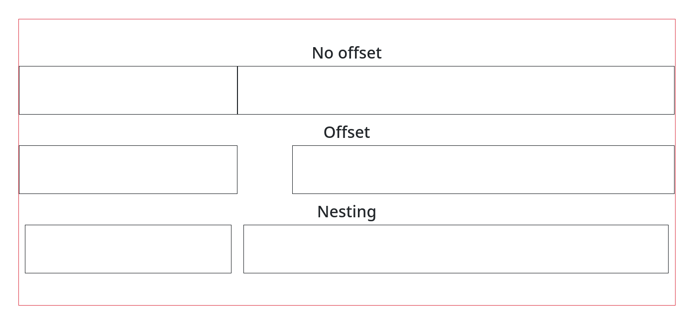

# Bootstrap

- **[Notes](#bootstrap---notes)**
- **[Resources](#bootstrap---resources)**

## Bootstrap - Notes

***Bootstrap*** is a framework used for building responsive, mobile-first sites.

To use ***Bootstrap***, you can either

- download the [Source Files](https://getbootstrap.com/docs/5.1/getting-started/download/) or
- use **jsDelivr**

  To do this, simple paste

      <link href="https://cdn.jsdelivr.net/npm/bootstrap@5.1.0/dist/css/bootstrap.min.css" rel="stylesheet" integrity="sha384-KyZXEAg3QhqLMpG8r+8fhAXLRk2vvoC2f3B09zVXn8CA5QIVfZOJ3BCsw2P0p/We" crossorigin="anonymous">
  inside the *\<head>* element of your ***HTML*** and

      
      
  right before the *\</body>* tag.

  Notice, the versions of the scripts are
  - bootstrap@5.1.0
  - popperjs/core@2.9.3

  Be careful to update them, in case this is outdated.

***Bootstrap*** requires the use of the ***HTML5*** doctype.

    <!doctype html>
    <html lang="en">
      ...
    </html>
***Bootstrap*** is developed mobile first, a strategy in which we optimize code for mobile devices first and then scale up components as necessary using ***CSS*** media queries. To ensure proper rendering and touch zooming for all devices, add the responsive viewport meta tag to your *\<head>*.

Basically, ***Bootstrap*** uses pre-defined classes that you asign to each element from within your ***HTML*** code. In this aspect, it is similar to ***Tailwind CSS*** but their use cases may differ.

### Spacing between columns

- No offset

      

        

        

      

- Offset

      

        

        

      

- Nesting

      

        

          

        

        

          

        

      

## Bootstrap - Resources

- [Bootstrap documentation](https://getbootstrap.com/docs/)
- [react-bootstrap documentation](https://react-bootstrap.github.io/getting-started/introduction/)
- [Use Bootstrap with React](https://www.creative-tim.com/blog/web-design/how-to-use-bootstrap-with-reactjs/)

[HOME](https://github.com/Stratis-Dermanoutsos/Full-Stack-2021#full-stack-roadmap-2021) or [Back to top](#bootstrap)
