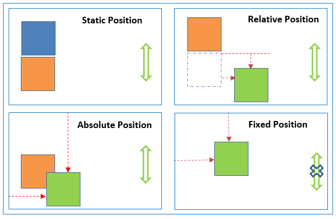

# CSS

- **[Notes](#css---notes)**
- **[Resources](#css---resources)**

## CSS - Notes

- Prefixes

  Prefixes are used to add CSS features, knowing that each browser will support them.

  Most common prefixes are:
  - *-webkit-* (for Android, Chrome, iOS, Safari)
  - *-moz-* (for Firefox)
  - *-ms-* (for Internet Explorer)
  - *-o-* (for Opera)

  For example, to ensure a transition would work on almost every browser, we'd have to write this

      -webkit-transition: all 4s ease;
      -moz-transition: all 4s ease;
      -ms-transition: all 4s ease;
      -o-transition: all 4s ease;
      transition: all 4s ease;
- Positions

  The *position* property specifies the type of positioning method used for an element.

  Possible values are:
  - *absolute*

        position: absolute;
    An element with this position value is positioned *relative* to the nearest positioned ancestor. If there is no ancestor, it uses the document body.

    *Absolute* positioned elements are removed from the normal flow and can overlap other elements.
  - *fixed*

        position: fixed;
    This value positions the element *relative* to the viewport. In other words, it always stays in the same place even if the page is scrolled.
  - *relative*

        position: relative;
    An element with the *relative* position value is positioned relative to its normal position.

    Setting the *top*, *right*, *bottom* and *left* properties of such element will adjust it away from its normal position.
  - *static*

        position: static;
    ***HTML*** elements are positioned *static* by default.

    *Static* positioned elements are not affected by the *top*, *right*, *bottom* and *left* properties.

    An element with this position value is not positioned in any special way and follows the normal flow of the page.
  - *sticky*

        position: sticky;
    A *sticky* element toggles between *relative* and *fixed*, depending on the scroll position. It is positioned *relative* until a given offset position is met in the viewport. Then, it 'sticks' in place (like an element with the *fixed* value)

  
- Responsive design

  There are some basic steps to follow in order to make a website resposive.
  - Paste

        <meta name="viewport" content="width=device-width, initial-scale=1.0">
    inside the *\<head>* element of the ***HTML*** document.
  - Don't use large fixed *width* or *height* for elements.

    For example, '*500px*' can be overwhelming for some devices' screens.
    Instead, use *min-width* or *max-width* (similar for *height*) attributes.
  - Use the ***HTML*** \<picture> tag for images.

        <picture>
          <source media="(min-width:650px)" srcset="img_lg.jpg">
          <source media="(min-width:465px)" srcset="img_md.jpg">
          
        </picture>
  - Use responsive size units for text.

        // Bad
        font-size: 10px;

        // Good
        font-size: 10vw;
  - Use Display layouts.

    Using **Grid** or **Flex** layout is always beneficial in order to make a web page responsive.
  - Use media ***CSS*** queries.

    Media query is a rule to include a block of CSS properties only if a certain condition is true.

        @media screen (min-width: 480px) {
          .element {
            width: 100px;
          }
        }
    Logical operators '*and*', '*or*' and '*not*' can be used for multiple conditions.

        @media screen (min-width: 480px) and (max-width: 768px) {
          /* CSS code */
        }
  - Use '*auto*' for media.

    If the '*width*' property is set to a percentage and the '*height*' is set to '*auto*', the image will be responsive.

## CSS - Resources

- [w3schools](https://www.w3schools.com/css/default.asp)
- [A Complete Guide to Flexbox by CSS-Tricks](https://css-tricks.com/snippets/css/a-guide-to-flexbox/)
- [A Complete Guide to Grid by CSS-Tricks](https://css-tricks.com/snippets/css/complete-guide-grid/)

[HOME](https://github.com/Stratis-Dermanoutsos/Full-Stack-2021#full-stack-roadmap-2021) or [Back to top](#css)
