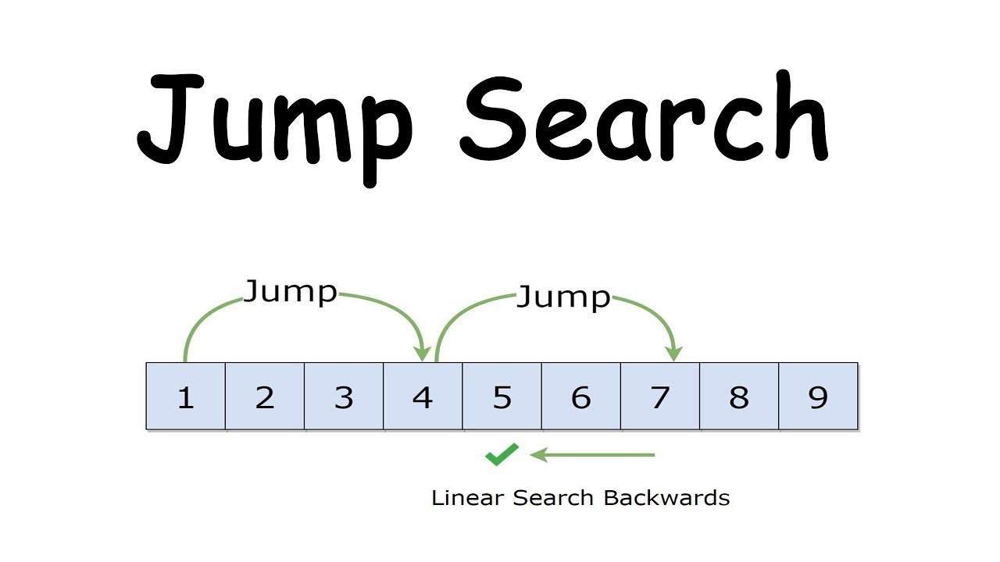
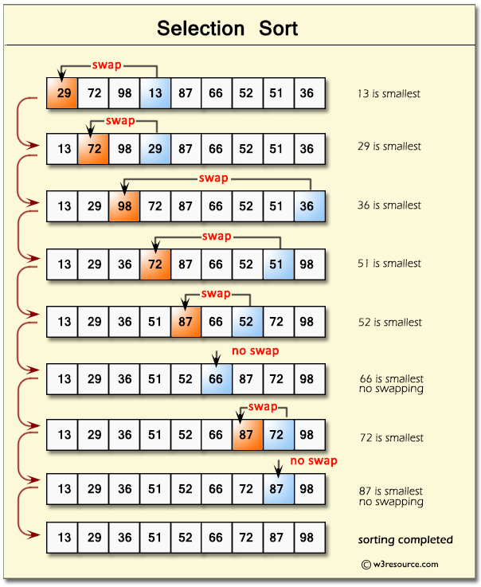
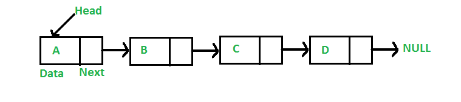
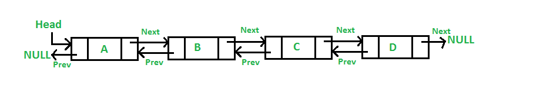
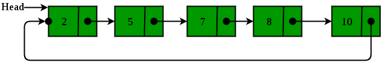
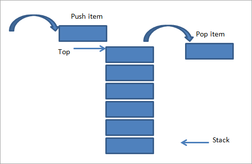

# Full-Stack Developer stack 2021

This is a repository holding information and resources for everyone interested in becoming a Full-Stack Web Developer in 2021.

As you can see, this stack is a bit biased as I chose ***React*** for Frontend and ***ASP.NET*** for Backend specifically.

Of course, there are other ***JS*** frameworks/libraries and other backend languages and are all appreciated.

## TECH STACK

- [ ] Frontend
  - [x] Basics
    - [x] ***HTML***
      - [x] Form and Validations
      - [x] Semantic and non-semantic ***HTML***
    - [ ] ***CSS***
      - [ ] Positions
      - [ ] Display (flex, grid)
      - [ ] Responsive design
    - [x] ***JavaScript***
  - [ ] Frameworks/Libraries
    - [x] ***Tailwind CSS***
    - [x] ***SASS***
    - [x] ***Bootstrap***
    - [x] ***React***

      Other options may be:
      - ***Angular***
      - ***Vue***
    - [ ] ***Redux***
    - [ ] ***jQuery***
  - [x] Version Control System (***Git*** & ***Github***)
  - [x] Package Manager (***NPM***)
  - [x] Module Bundler (***Webpack***)
- [ ] Backend
  - [x] ***HTTP***
  - [x] ***C#***
  - [ ] ***MVC*** structure
  - [ ] Process management
  - [ ] Threads & Concurrency
  - [ ] Server-Client
  - [ ] ***API***s
  - [ ] ***ASP .NET*** (***C#***)

    Other options may be:
    - ***Spring Boot*** (***JAVA***)
    - ***Django*** (***Python***)
    - ***Ruby on Rails*** (***Ruby***)
    - ***Flask*** (***Python***)
  - [ ] Databases
    - [x] ***MySQL***
    - [x] ***SQLite***
    - [x] ***PostgreSQL***
    - [ ] ***MongoDB***
  - [ ] CI/CD Tools
    - [ ] ***Jenkins***
    - [ ] ***GitLab***
  - [ ] Cloud Providers
    - [ ] ***AWS***
    - [ ] ***Azure***
  - [ ] Learn concept and how to setup
    - [ ] Reverse and Forward proxy
    - [ ] Load Balancer
    - [ ] Caching Server
    - [ ] Firewall
- [ ] Algorithms
  - [x] Search
    - [x] Linear
    - [x] Binary
    - [x] Exponential
    - [x] Jump
  - [ ] Sort
    - [x] Bubble
    - [x] Counting
    - [x] Selection
    - [ ] Merge
    - [ ] Quick
  - [ ] BST
    - [ ] Inverse
    - [ ] Traversals
      - [ ] Inorder
      - [ ] Preorder
      - [ ] Postorder
      - [ ] Level order
- [ ] Data Structures
  - [ ] Binary Search Tree
  - [ ] Heap
  - [ ] AVL Tree
  - [x] Singly Linked List
  - [x] Doubly Linked List
  - [x] Circular Linked List
  - [x] Queue
  - [ ] Priority Queue
  - [x] Stack

## GOAL PROJECTS

- [ ] Blog
- [ ] e-Commerce webapp
- [ ] Responsive, mobile-first portfolio page

## PERSONAL NOTES

### HTML - notes

- Form and Validations

  - Forms

    A form in ***HTML5*** is declared with the tag *\<form>* and consists of every element that is found before the closing tag *\</form>*.

    The \<form> element is a container for different types of input elements, such as: text fields, checkboxes, radio buttons, submit buttons, etc.

    To declare any of these inputs, we use the input element, *\<input>*.
    For the type of the input, we simple declare it inside the tag with the attribute **type**.

    For example, *\<input type="text">*.
  - Validations

    Go to any popular site with a registration form, and you will notice that they provide feedback when you don't enter your data in the format they are expecting. You'll get messages such as:
    - "This field is required" (You can't leave this field blank).
    - "Please enter your phone number in the format xxx-xxxx" (A specific data format is required for it to be considered valid).
    - "Please enter a valid email address" (the data you entered is not in the right format).
    - "Your password needs to be between 8 and 30 characters long and contain one uppercase letter, one symbol, and a number." (A very specific data format is required for your data).

    This is called **form validation**. When you enter data, the browser and/or the web server will check to see that the data is in the correct format and within the constraints set by the application. Validation done in the browser is called **client-side** validation, while validation done on the server is called **server-side** validation.

    We want to
    - **get the right data, in the right format**. Our applications won't work properly if our users' data is stored in the wrong format, is incorrect, or is omitted altogether.
    - **protect our users' data**. Forcing our users to enter secure passwords makes it easier to protect their account information.
    - **protect ourselves**. There are many ways that malicious users can misuse unprotected forms to damage the application.

    **Different types of client-side validation**:
    - **Built-in form validation** uses ***HTML5*** form validation features. This validation generally doesn't require much ***JavaScript***. Built-in form validation has better performance than ***JavaScript***, but it is not as customizable as **JavaScript validation**.
    - **JavaScript validation** is coded using ***JavaScript***. This validation is completely customizable, but you need to create it all (or use a library).

    **Using built-in form validation attributes**:
    - ***required***: Specifies whether a form field needs to be filled in before the form can be submitted.
    - ***minlength*** and ***maxlength***: Specifies the minimum and maximum length of strings.
    - ***min*** and ***max***: Specifies the minimum and maximum values of numerical input types.
    - ***type***: Specifies whether the data needs to be a number, an email address, or some other specific preset type.
    - ***pattern***: Specifies a regular expression that defines a pattern the entered data needs to follow.
- Semantic and non-semantic ***HTML***

  A Semantic element clearly describes its meaning to both the browser and the developer.

  - non-semantic elements: *\
*, *\*
  - semantic elements: *\<article>*, *\<footer>*, *\<form>*, *\<header>*, etc

  

### JavaScript - notes

- Basics of ***JavaScript*** (from ***[Speaking JavaScript](http://speakingjs.com)***)
- ***obj.propKey = value*** and ***obj['propKey'] = value*** are equal
- if ***1 = 0001***, then ***~1 = 1110***
- ***'abc'.charAt(1)*** and  ***'abc'[1]*** are equal, tho some older browsers don't support the latter
- Comparing strings
  - is case-sensitive

        > 'B' > 'A' // true
        > 'B' > 'a' // false
  - doesn't handle umlauts and accents well

        > 'b' > 'ä' // false

***C#*** vs ***JavaScript*** (only notable differences/similarities as I am used to writing code in ***C#***)

|  | C#      | JavaScript |
| ----------- | ----------- | ----------- |
| types | int, float, double, char, bool, ... | let, var, const |
| methods | \<access> \<type> \<name>(\<type> x)  | function \<name>(x) |
| named parameters | fun(x=4) | fun({ x: 4 }) |
| print | System.Console.WriteLine(str) | console.log(str) |
| str -> num | int.Parse(str) | +str (or parseInt(str)) |
| num -> str | num.ToString() | num.toString() |
| exceptions | try {} catch(Exception) {} | try {} catch(exception) {} |
| closures | return delegate() { return val;}; | return function() { return val;} |
| foreach | foreach (int elem in arr) {} | for (var elem in arr) {} |
| using | using (obj) {} | with (obj) {} |
| class | class Dog { string name; public Dog(string x) { this.name = x; } } | function Dog(x) { this.name = x; } |
| inheritance | class Subclass : Baseclass | var subclass = { [[Prototype]]: baseclass } |
| accessors | \<type> X { get {return x;} set {x = value;} } | get X() { return x; }, set X(value) { x = value; } |
| regular expressions | Regex reg = new Regex(@"^\w") | /^\w/ |

### SASS - notes

- ***SASS*** means ***Syntactically Awesome StyleSheets***
- ***Variables***

      $red = hsl(0, 100%, 50%);
- ***Nesting***, used to avoid repeating the same classes names

      // CSS
      button a {
        font-weight: bold;
      }

      button.danger {
        color: red;
      }

      // SCSS
      button {
        a {
          font-weight: bold;
        }

        .danger {
          color: red;
        }
      }
  or for ***pseudo classes*** and ***pseudo elements***

      // CSS
      button:hover { }

      button:focus { }

      // SCSS
      button {
        &:focus { }
        &:hover { }
      }
- ***Mixins***

      // CSS
      .card {
        display: flex;
        flex-direction: column;
        background: gray;
      }

      .aside {
        display: flex;
        flex-direction: column;
        background: gray;
      }

      // SCSS
      @mixin flex-column {
        display: flex;
        flex-direction: column;
        background: gray;
      }

      .card {
        @include flex-column;
      }

      .aside {
        @include flex-column;
      }
  They can also take arguments

      @mixin flex-column($color) {
        display: flex;
        flex-direction: column;
        background: $color;
      }

      .card {
        @include flex-column(gray);
      }
- ***if-else*** statements

      @if $theme == 'light' {
        background-color: $light-bg;
      } @else {
        background-color: $dark-bg;
      }
- ***foreach*** loops

      $sizes: 40px, 50px, 80px;

      @each $size in $sizes { }

- ***functions***

      @function sum($numbers) {
        $sum = 0;

        @each $number in $numbers {
          $sum: $sum + $number;
        }

        return $sum;
      }

- Color adjustments

      $base-color: green;

      .card {
        background: lighten($base-color, 25%);
        color: darken($base-color, 25%);
      }

- Inline SVG color through variable

      $color: #FFF;

      @function hex_to_rgb($hex) {
        @return "rgb("+red($hex)+","+green($hex)+","+blue($hex)+")";
      }

      $svg1: url('data:image/svg+xml;utf8,<svg ...fill="#{$color}".../></svg>');
      $svg2: url('data:image/svg+xml;utf8,<svg ...fill="#{hex_to_rgb($color)}".../></svg>');
  Why this is useful? Cause sometimes ***SVG***s will be needed inside your ***SCSS*** and this is the easiest and most efficient way to change their color.
  Notice the use of function. Mozilla does not support ***HEX*** values so we convert the value to ***RGB***.

### Bootstrap - notes

***Bootstrap*** is a framework used for building responsive, mobile-first sites.

To use ***Bootstrap***, you can either

- download the [Source Files](https://getbootstrap.com/docs/5.1/getting-started/download/) or
- use **jsDelivr**

  To do this, simple paste

      <link href="https://cdn.jsdelivr.net/npm/bootstrap@5.1.0/dist/css/bootstrap.min.css" rel="stylesheet" integrity="sha384-KyZXEAg3QhqLMpG8r+8fhAXLRk2vvoC2f3B09zVXn8CA5QIVfZOJ3BCsw2P0p/We" crossorigin="anonymous">
  inside the *\<head>* element of your ***HTML*** and

      
      
  right before the *\</body>* tag.

  Notice, the versions of the scripts are
  - bootstrap@5.1.0
  - popperjs/core@2.9.3

  Be careful to update them, in case this is outdated.

***Bootstrap*** requires the use of the ***HTML5*** doctype.

    <!doctype html>
    <html lang="en">
      ...
    </html>
***Bootstrap*** is developed mobile first, a strategy in which we optimize code for mobile devices first and then scale up components as necessary using ***CSS*** media queries. To ensure proper rendering and touch zooming for all devices, add the responsive viewport meta tag to your *\<head>*.

Basically, ***Bootstrap*** uses pre-defined classes that you asign to each element from within your ***HTML*** code. In this aspect, it is similar to ***Tailwind CSS*** but their use cases may differ.

[Use ***Bootstrap*** with ***React***](https://www.creative-tim.com/blog/web-design/how-to-use-bootstrap-with-reactjs/).

### React - notes

- Install

      npm install -g create-react-app
- Create React project

      # after installation
      create-react-app <project-directory> # general syntax
      create-react-app .                   # inside current directory

      # without installation (better as it always uses the latest version)
      npx create-react-app <project-directory> # general syntax
      npx create-react-app .                   # inside current directory
- Commands
  - Start the development server

        npm start
  - Bundle the app into static files for production

        npm run build
  - Start the test runner

        npm test
  - Remove this tool and copy build dependencies, configuration files and scripts into the app directory

        npm run eject
    Once you run this, there is no turning back!
- ***JSX***

  ***JSX*** is a syntax extension for ***JavaScript***. It was written to be used by ***React*** and looks a lot like ***HTML***. Given ***JSX*** is not valid ***JavaScript***, web browsers can't read it directly.

  ***JSX*** is an inline markup that looks like ***HTML*** and gets transformed to ***JavaScript***. A ***JSX*** expression starts with an ***HTML***-like open tag, and ends with the corresponding closing tag. ***JSX*** tags support the ***XML*** self close syntax so you can optionally leave the closing tag off.

  For example,

      return (
        

          <h1>Hello!</h1>
          <h2>Good to see you here.</h2>
        

      );
- Hooks

  UI components are often dynamic.

  Developers had to build and use classes to use certain ***React***'s features.
  While classes are still there, hooks are a more ergonomic option.

  Hooks enable the developer to re-use stateful logic.
  Without them, it is easy, and sometimes even necessary, to wrap components inside components and repeat this process a lot of time, eventually getting lost.

  Basically, hooks are functions that generally start with the word '*use*'.

  Basic rule: ***Only call them at the top level of a function***!

  - ***useState()***

        import { useState } from 'react';
    Its purpose is to handle reactive data. Any data that changes is called *state*.
    So, when there is a change in the *state*, ***React*** re-renders the UI to display those changes.

        const [count, setCount] = useState(0);
        /* - 'count' is called reactive value.
           - 'setCount' is called setter.
           - inside the parentheses, we define the default state.
              In this example, we set 'count' equal to 0. */
  - ***useEffect()***

        import { useEffect } from 'react';
    It exists to handle the lifecycle of a component.

    The code bellow runs every time a state is changed.

        useEffect(() => {
          alert('Hello component'); // Called when component is initiallized

          return () => alert('Goodbye component'); // Called when component is destroyed
        }, []) // the ', []' is optional and works as an array of dependencies
    Example case

        const [count, setCount] = useState(0);
        const [loaded, setLoaded] = useState(false);

        /* This causes an infinite loop
        This is because everytime we fetch, we update the state, triggering another fetch */
        useEffect(() => {
          fetch('foo').then(() => setLoaded(true))
        })

        /* So, we add 'count' as a dependency
        The brackets [] work to add an array of dependencies, in which 'count' is added.
        This time, this runs only when 'count' changes */
        useEffect(() => {
          fetch('foo').then(() => setLoaded(true))
        }, [count])
  - ***useContext()***

        import { useContext } from 'react';
    It allows the developer to work with ***React***'s context API. In other words, share data without passing props.

        const moods = {
          happy: '😃',
          sad: '😢'
        }

        const MoodContext = createContext(moods);

        function App() {
          return (
            <MoodContext.Provider value={moods.happy}>
              <MoodEmoji />
            </MoodContext.Provider>
          );
        }

        function MoodEmoji() {
          const mood = useContext(MoodContext);

          return 
{ mood }

        }
    In the code above, when the mood value changes inside parent, it changes in the 'MoodEmoji' component too.

    The ***useContext()*** hook is a cleaner version of a 'Consumer' component.
  - ***useRef()***

        import { useRef } from 'react';
    It's used to grab a value that changes but does not re-render the UI.

        function App() {
          const count = useRef(0);

          return (
            <button onClick={ () => count.current++ }>
              { count.current }
            </button>
          );
        }
    In the code above, the value of 'count' changes but the displayed value stays the same.

    A more common use is to grab ***HTML*** elements from ***JSX***.

        function App() {
          const myBtn = useRef(null);

          const clickIt = () => myBtn.current.click();

          return (
            <button ref={myBtn}></button>
          );
        }
  - ***useReducer()***

        import { useReducer } from 'react';
    It is basically a different way to manage state

        function reducer(state, action) {
          switch (action.type) {
            case 'increment':
              return state + 1;
            case 'decrement':
              return state - 1;
            default:
              throw new Error();
          }
        }

        function App() {
          const [state, dispatch] = useReducer(reducer, 0);

          return (
            <>
              Count: {state}
              <button onClick={() => dispatch({type: 'increment'})}>+</button>
              <button onClick={() => dispatch({type: 'decrement'})}>-</button>
            </>
          );
        }
  - ***useMemo()***

        import { useMemo } from 'react';
    It is used to optimize computation cost for improved performance.

    It is only recommended for expensive calculations.

        const [count, setCount] = useState(0);

        /* We compute the 'countExpensive' everytime the value of 'count' changes.
        This happens because we added 'count' as a dependency. */
        const countExpensive = useMemo(() => {
          return count ** 2;
        }, [count]);
  There are more hooks, but I kept it simple and focused to the common ones.
- Example of simple todolist app using 3 files
  - App.js

        import React, { useState, useRef } from 'react';
        import TodoList from './TodoList';
        import { uniqueId } from 'lodash';

        function App() {
            /* This is a state variable, using the 'useState' hook.
            It is used so React re-renders things when the state is changed. */
            const [todos, setTodos] = useState([]);

            /* The 'useRef' hook allows us to reference elements inside our HTML.
            Notice the ref tag inside our input elements. */
            const todoNameRef = useRef();

            /* This function is called by a Todo item when its checkbox element is clicked. */
            function toggleTodo(id) {
                const newTodos = [...todos];
                const todo = newTodos.find(todo => todo.id === id);
                todo.complete = !todo.complete;
                setTodos(newTodos);
            }

            function handleAddTodo() {
                const name = todoNameRef.current.value; // Current value of the input field.
                if (name === '') return; // If the input field is empty, do nothing.

                setTodos([...todos, { id: uniqueId(), name: name }]); // Add the new todo to the list.
                todoNameRef.current.value = ''; // Reset the input field.
            }

            /* Remove all elements that are complete.
            This can be achieved by filtering our list and keeping only non-completed tasks */
            function handleDeleteCompleted() {
                const newTodos = todos.filter(todo => !todo.complete);
                setTodos(newTodos);
            }

            // Render the app.
            return (
                <>
                    <TodoList todos={todos} toggleTodo={toggleTodo} /> {/* Renders the todos list */}
                    <input ref={todoNameRef} type="text" placeholder="Add a todo" />
                    <button onClick={handleAddTodo}>Add todo</button>
                    <button onClick={handleDeleteCompleted}>Clear completed</button>
                </>
            );
        }

        export default App;
  - TodoList.js

        import React from 'react';
        import Todo from './Todo';

        /* Takes a list of todos and for each todo, 
        it returns a Todo component with the todo's text and id. */
        export default function TodoList({ todos, toggleTodo }) {
            return (
                todos.map(todo => {
                    return <Todo key={todo.id} todo={todo} toggleTodo={toggleTodo} />
                })
            );
        }
  - Todo.js

        import React from 'react';

        /* Takes the todo and returns its name along with a checkbox */
        export default function Todo({ todo, toggleTodo }) {
            function handleTodoClick() {
                toggleTodo(todo.id);
            }

            return (
                

                    <label>
                        <input type="checkbox" checked={!!todo.complete} onChange={handleTodoClick} />
                        {todo.name}
                    </label>
                

            )
        }
- Images

      import logo from './images/logo.png';
      .
      .
      .
        

### NPM - notes

To install ***NPM***, simply install ***[Node.js](https://nodejs.org)***.

- Install
  - without arguments

        npm i       # option 1
        npm install # option 2
    Running **npm install** without arguments installs modules defined in the dependencies section of the **package.json** file.
  - with arguments

        npm install <package>             # install specified package
        npm install <package1> <package2> # install multiple packages
        npm install <package>@<version>   # install specified version of package
  - Options
    - (with ***--global***)

          npm install -g       # option 1
          npm install --global # option 2
      When run with **--global** or **-g**, **npm install** installs the package globally. This means the package is installed in two places. The first is at the root directory where **package.json** is defined. The second is the global node_modules folder on the user system.
    - (with ***--save***)

          npm install <package> -S     # option 1
          npm install <package> --save # option 2
      When run with **--save**, **npm install** modifies the **package.json** file to include the specified package as a dependency. In this case, the express package will be added as a dependency to **package.json**.
    - (with ***--save-dev***)

      The **--save-dev** flag specifies that the package should be added to the devDependencies section of the **package.json** rather than the dependencies section.
    - (with ***--production***)

          npm install -p           # option 1
          npm install --production # option 2
      The **--production** flag specifies to exclude devDependencies from the install. This means any dependency listed under the devDependencies section of package.json won't get installed when this flag is present.
- Uninstall

      npm (-g) un <package>
      npm (-g) uninstall <package>
- List installed packages

      npm list -g --depth=0 # global
      npm list              # local
- Update (global) packages

      npm up (-g) <package1> <package2> <package3>     # option 1
      npm update (-g) <package1> <package2> <package3> # option 2
- Update ***NPM***

      npm install -g npm@latest # multiplatform
      npm-windows-upgrade       # for windows
- Fix issues (for example, when you move a project to another machine)

      npm audit fix
      npm audit fix --force

### Module bundlers - notes

A module bundler is a tool that takes pieces of JavaScript and their dependencies and bundles them into a single file.

A website is built using multiple tools.
For example, JavaScript, HTML, CSS would be considered the bare minimum.
However, things are a lot more complicated nowadays for a complete website to be built and many languages, tools and libraries are usually needed. To combine them all for optimization and to make sure they all work together is a difficult task. That's where Module bundlers come in.

A module bundler, basically, bundles all the assets used together.

### Webpack - notes

For test,

- Create a project and make a file ***index.js*** inside a folder ***src***
- Open a terminal in that project's folder and type

      npm init -y
  to create a ***package.json*** file
- Install a module for testing

      npm i lodash
- Create a folder ***public*** inside the project's folder and create ***index.html*** file inside this folder and paste

      <!DOCTYPE html>
      <html>
          <head>
              <meta charset="utf-8">
              <meta name="viewport" content="width=device-width, initial-scale=1.0">
              <title>Document</title>

              
          </head>
          <body>
              
          </body>
      </html>
- Inside the ***index.js*** file, paste

      import { camelCase } from 'lodash';

      console.log(camelCase('hello world'));

If you open ***index.html*** with a browser and head to the console, you'll notice an error.

- Open a terminal in the project's folder and type

      npm i --save-dev webpack-cli webpack
  to install ***Webpack***
- Open the ***package.json*** file and paste

      "build": "webpack"
  inside the *"scripts"* section
- Open a terminal in the project's folder and type

      npm run build
  to compile our code
- Now, inside the ***index.html***, change the script src attribute like so

      

If you head back to the browser and open the console, you will see a '***helloWorld***' being printed successfully.

It is very important to know that ***Webpack*** is currently using the **DEFAULT** configuration which means that it is specifically looking for the ***index.js*** file inside the ***src*** folder. However, in some cases, you will want/need to configure ***Webpack*** yourself.

- Create a ***webpack.config.js*** file inside our project's folder and paste

      module.exports = {
        entry: './src/index.js',
      };
  Notice, to include many entry points (this is called **CODE SPLITTING**) you need

      module.exports = {
        entry: {
          foo: 'foo.js',
          bar: 'bar.js'
        },
      };
  More options, for example, **output**

        const path = require('path');

        module.exports = {
          entry: './src/index.js',
          output: {
            filename: 'awesome.js',
            path: path.resolve(__dirname, 'dist'),
          },
        };
- Include ***SASS***
  - Inside the ***src*** folder, create a file ***style.scss*** and paste your desired or even random ***SCSS*** code

        $text: orange;
        $bg: black;

        body {
          color: $text;
          background: $bg;
        }
  - Include it in the ***index.js*** file

        import './style.scss';
  Now, notice that if you try to build with

      npm run build
  an error will occure. That's because we do not have a loader for our ***SASS***.

  To solve this, simply open a terminal in the project's folder and type

      npm install --save-dev css-loader style-loader sass-loader sass
  - Include the modules in the ***webpack.config.js*** file, inside the *"module.exports"* section. The end result should look like this

        const path = require('path');

        module.exports = {
            entry: './src/index.js',
            output: {
                filename: 'main.js',
                path: path.resolve(__dirname, 'dist'),
            },
            module: {
                rules: [
                    {
                        test: /\.scss$/,
                        use: [
                            'style-loader',
                            'css-loader',
                            'sass-loader',
                        ],
                    },
                ],
            },
        };
- Analyze bundle (using **plugins**)
  - Open a terminal in the project's folder and type

        npm install --save-dev webpack-bundle-analyzer
  - Paste

        const BundleAnalyzerPlugin = require('webpack-bundle-analyzer').BundleAnalyzerPlugin;
    in the ***webpack.config.js*** file, outside of the *"module.exports"* section and

        plugins: [
          new BundleAnalyzerPlugin()
        ],
    inside the section.
  - When you build, you should see this screen

    
- Setup local web server
  - Open a terminal in the project's folder and type

        npm install --save-dev webpack-dev-server
  - In the ***webpack.config.js*** file, outside of the *"module.exports"* section, paste

        devServer: {
          contentBase: path.join(__dirname, 'public'),
          port: 9000
        },
  - Open the ***package.json*** file and paste

        "dev": "webpack serve"
    inside the *"scripts"* section
  - Start server by typing

        npm run dev
    inside the terminal

### HTTP - notes

***HTTP*** means **HyperText Transfer Protocol**.

As a request-response protocol, ***HTTP*** gives users a way to interact with web resources such as HTML files by transmitting hypertext messages between clients and servers.

***HTTP*** is a method for encoding and transporting information between a client (such as a web browser) and a web server.

***HTTP*** requests are:

- ***CONNECT***: The ***CONNECT*** method establishes a tunnel to the server identified by the target resource.
- ***DELETE***: The ***DELETE*** method deletes the specified resource.
- ***GET***: The ***GET*** method requests a representation of the specified resource. Requests using ***GET*** should only retrieve data.
- ***HEAD***: The ***HEAD*** method asks for a response identical to that of a ***GET*** request, but without the response body.
- ***OPTIONS***: The ***OPTIONS*** method is used to describe the communication options for the target resource.
- ***PATCH***: The ***PATCH*** method is used to apply partial modifications to a resource.
- ***POST***: The ***POST*** method is used to submit an entity to the specified resource, often causing a change in state or side effects on the server.
- ***PUT***: The ***PUT*** method replaces all current representations of the target resource with the request payload.
- ***TRACE***: The ***TRACE*** method performs a message loop-back test along the path to the target resource.

### Search Algorithms - notes

- ***Linear Search***

  Time Complexity: *O(n)*

  As the name implies, it works in a linear manner.

  Start from the left-most element of the array and one by one compare each with x.

  

- ***Binary Search***

  Time Complexity: *O(log n)*

  **Binary Search** is another basic search algorithm. Unlike **Linear Search**, it needs a sorted array of elements to work.

  Basically, using the 2 edges of the array, we compare the middle element with x.

  If (element > x) left = middle + 1

  If (element < x) right = middle - 1

  If (element == x) return element's index

  

  Notice that after each comparison, we ignore half of the elements we had.

- ***Exponential Search***

  Time Complexity: *O(log n)*

  First, we search for the range where element is present.

  This is achieved by starting with subarray size 1, compare its last element with x, then doubling the size until last element of a subarray is not greater.

  Once we find an index *i*, we just have to search in the range [*i/2*, *i*]. To do so, we use **Binary Search**.

  Like **Binary Search**, we need a sorted array to work with.

- ***Jump Search***

  Time Complexity: *O(√n)*

  Like **Binary Search**, **Jump Search** is a searching algorithm for sorted arrays.

  The basic idea is to check fewer elements (than **Linear Search**) by jumping ahead by fixed steps or skipping some elements in place of searching all elements.

  Then, we **Linear Search** backwards from there until we find the element or we reach the index of the previous step. (i-step)

  After each jump, we compare the current element with x.

  If (element > x) LinearSearch()

  If (element < x) Jump => (i = i + step)

  If (element == x) return element's index

  

### Sort Algorithms - notes

- ***Bubble Sort***

  Time Complexity: *O(n)*

  **Bubble Sort** is the simplest sorting algorithm that works by repeatedly swapping the adjacent elements if they are in wrong order.

  

- ***Counting Sort***

  Time Complexity: *O(n+k)* where n is the number of elements in input array and k is the range of input.

  ***Counting Sort*** is similar to hasing. It works by counting the number of objects having distinct key values.

  For examle, take the array

      [1, 4, 1, 2, 7, 5, 2]
  So, we make an array to count our elements
  | index | 0 | 1 | 2 | 3 | 4 | 5 | 6 | 7 |
  | ----- | - | - | - | - | - | - | - | - |
  | count | 0 | 2 | 2 | 0 | 1 | 1 | 0 | 1 |

  or

      [0, 2, 2, 0, 1, 0, 1]
  as we have x0 0s, x2 1s and so on.

  The result would be

      [1, 1, 2, 2, 4, 5, 7]
- ***Selection Sort***

  Time Complexity: *O(n²)*

  Basically, we devide the array into 2 subarrays, 1 sorted and 1 unsorted.

  Start from the left-most element and with each iteration, the minimum element (considering ascending order) from the unsorted subarray is picked and moved to the sorted subarray.

  

### Data Structures - notes

- ***Singly Linked List***

  ***Singly Linked List*** is basically a one-way chain of nodes.

  The list has a '*Head*' node that serves as its first of the chain.

  Each node has a value and a pointer "pointing" to the next node.

  
- ***Doubly Linked List***

  ***Doubly Linked List*** is similar to the ***Singly Linked List*** with a few additions.

  Each node has an extra pointer that "points" to the previous node too.

  The list itself, instead of a reference to the '*Head*' node, also has one for the '*Tail*' node of the list, the last.

  This type of ***Linked List*** can be traversed either starting from the '*Head*' or the '*Tail*' node.

  
- ***Circular Linked List***

  ***Circular Linked List*** is similar to the ***Singly Linked List*** with 1 basic change.

  The last node of this ***Linked List*** always points to the '*Head*' creating an endless chain.

  

- ***Queue***

  ***Queue*** is a linear structure which follows a particular order in which the operations are performed. The order is **F**irst **I**n **F**irst **O**ut (**FIFO**).  

  A good example of queue is any queue of consumers for a resource where the consumer that came first is served first.

  Operations:

  - Front

    Get the front element of the queue
  - Rear

    Get the rear element of the queue
  - Enqueue

    Add an element to the rear of the queue
  - Dequeue

    Remove the front element of the queue

  

- ***Stack***

  ***Stack*** is a linear structure which follows a particular order in which the operations are performed. The order is **L**ast **I**n **F**irst **O**ut (**LIFO**).  

  A good example of stack can be a stack of plates in a canteen. The last plate to go to the stack is the first one to get removed, to either be used or washed.

  Operations:

  - Push

    Adds an item in the stack
  - Pop

    Removes an item from the stack
  - Top

    Returns top element of stack
  - isEmpty

    Returns true if stack is empty, else false

  

## RESOURCES

A list of both free and paid resources that I have used and seemed very useful to me.

### HTML - resources

- [w3schools](https://www.w3schools.com/html/default.asp)
- [Form and Validations](https://developer.mozilla.org/en-US/docs/Learn/Forms/Form_validation)

### CSS - resources

- [w3schools](https://www.w3schools.com/css/default.asp)

### JavaScript - resources

- [Speaking JavaScript book](http://speakingjs.com)
- [w3schools](https://www.w3schools.com/js/default.asp)

### Tailwind CSS - resources

- [Tailwind CSS documentation](https://tailwindcss.com/docs)
- [Tailwind CSS cheat sheet 1](https://umeshmk.github.io/Tailwindcss-cheatsheet/)
- [Tailwind CSS cheat sheet 2](https://nerdcave.com/tailwind-cheat-sheet)

### SASS - resources

- [Fireship video](https://youtu.be/akDIJa0AP5c)

### Bootstrap - resources

- [Bootstrap documentation](https://getbootstrap.com/docs/)

### React - resources

- [Fireship video (explanation)](https://youtu.be/Tn6-PIqc4UM)
- [Web Dev Simplified video (introduction)](https://youtu.be/hQAHSlTtcmY)
- [Fireship video (hooks)](https://youtu.be/TNhaISOUy6Q)

### Git - resources

- [Udemy course by Jad Khalili](https://www.udemy.com/share/101tpK2@PkdjVEtSSVIKdkRKBmJNfj4=/)
- [w3schools](https://www.w3schools.com/git/default.asp)

### NPM - resources

- [NPM documentation](https://docs.npmjs.com)

### Module Bundlers & Webpack - resources

- [Fireship video](https://youtu.be/5IG4UmULyoA)
- [webpack-bundle-analyzer documentation](https://www.npmjs.com/package/webpack-bundle-analyzer)

### C\# - resources

- [Udemy course by Denis Panjuta](https://www.udemy.com/share/101vEs2@Pm5KfWJSSVIKdkRKBkhOVD5uY1c=/)

### Algorithms - resources

- [GeeksForGeeks](https://www.geeksforgeeks.org/fundamentals-of-algorithms/)
- [my GitHub repository](https://github.com/Stratis-Dermanoutsos/Algorithms-C-Sharp/)

### Data Structures - resources

- [GeeksForGeeks](https://www.geeksforgeeks.org/data-structures/)
- [my GitHub repository](https://github.com/Stratis-Dermanoutsos/Data-Structures-C-Sharp/)